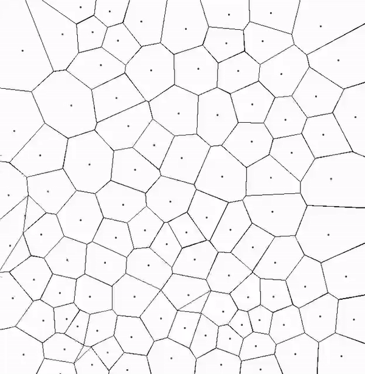

# Lloyd relaxation

<p align="center">
  
</p>

## How to build

```bash
cmake --build build --target lloyd_relaxation lloyd_relaxation_ir
```

CMake target:

- **lloyd_relaxation**: a program visualizing the process of Lloyd relaxation of 100 points
- **lloyd_relaxation_ir**: LLVM IR of [lloyd_relaxation.c](/00-graphics-application/src/lloyd_relaxation.c)

You may also find precompiled version of LLVM IR [here](/00-graphics-application/IR/lloyd_relaxation.ll).
