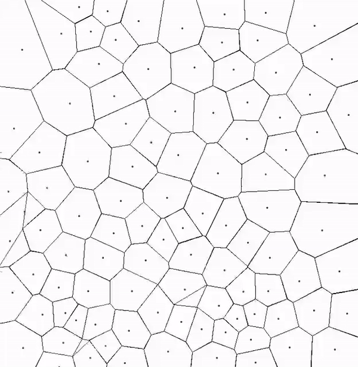

# Lloyd relaxation

<p align="center">
  
</p>

## Requirements

The following applications and libraries have to be installed:

- CMake of version 3.21 (or higher)
- libsdl2-dev

## How to install

```bash
git clone git@github.com:KetchuppOfficial/LLVM_Course.git
cd LLVM_Cource/00-graphics_application
```

## How to build

### 0) Make sure you are in the root directory of the task (i.e. LLVM_Course/00-graphics_application/)

### 1) Build the project

```bash
cmake -B build -DCMAKE_BUILD_TYPE=Release
cmake --build build [--target <tgt>]
```

**tgt** can be

- **lloyd_relaxation**: a program visualizing the process of Lloyd relaxation of 100 points
- **lloyd_relaxation_ir**: LLVM IR of [lloyd_relaxation.c](/00-graphics_application/src/lloyd_relaxation.c)

If --target option is omitted, all targets will be built.

You may also find precompiled version of LLVM IR [here](/00-graphics_application/IR/lloyd_relaxation.ll).

You can install both the binary and IR-file into *./bin* directory with the command

```bash
cmake --install build
```
